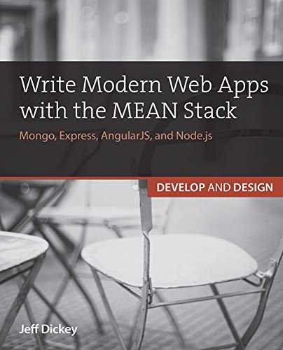

Sample project for [Write Modern Web Apps with the MEAN Stack](http://www.amazon.com/Write-Modern-Apps-MEAN-Stack/dp/0133930157) by [Jeff Dickey](https://dickey.xxx)

This repo has separate branches for each chapter with code for each one to follow along.

Changes
=======

As JavaScript and the web is always changing, here are some of the ways this codebase has moved away from the book:

**If you see anything that is confusing, seems like a step is skipped, or that is different from the book than here, please [submit an issue](https://github.com/dickeyxxx/mean-sample/issues). I want to make sure this code is as helpful as possible and should get back to you quickly.**

Express res.send -> res.sendStatus
----------------------------------

Express deprecated the syntax for simple HTTP responses. You used to be able to say `res.send(401)` and it would reply 'Unauthorized' along with the HTTP code, this is deprecated in favor of `res.sendStatus(401)` which does the same thing.
